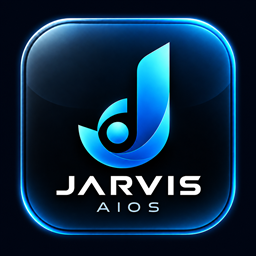
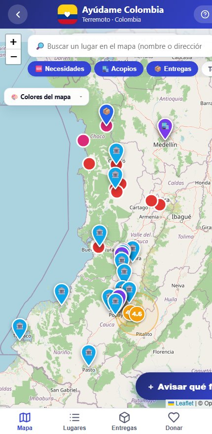

# Ángel Garzón Sarzosa

### AI Solutions Architect & Engineer

**AI agents · Voice interfaces · Business automation · Robotics**

I turn operational problems into working software: AI agents, knowledge systems and tools that connect people, data and business workflows. My background in Industrial Automation Engineering brings robotics, computer vision and systems thinking to the products I build today.

Based in **Popayán, Colombia** · Research experience in **Spain**

[Portfolio](https://angelszs.site/?enfoque=perfil) · [LinkedIn](https://www.linkedin.com/in/angel-garz%C3%B3n-sarzosa-334014337/) · [Email](mailto:angelgarzonsarzosa@gmail.com) · **[Leer en español](README.es.md)**

---

## What I'm building

<table>
<tr>
<td width="33%" valign="top" align="center">

<h3>Jarvis AIOS</h3>

Voice, personal knowledge and software tools connected through an assistant that can act.

<strong>Independent project · Active development</strong>

<a href="projects/jarvis-aios.md">Architecture & decisions →</a>
</td>
<td width="33%" valign="top" align="center">

<h3>Ayúdame Colombia</h3>

A mobile web app for coordinating needs, collection points and deliveries during emergencies.

<strong>Public source · Deployed PWA</strong>

<a href="projects/ayudame-colombia.md">Product & engineering →</a>
</td>
<td width="33%" valign="top" align="center">

<h3>ZOSA Pages</h3>

A workflow for creating business websites and editing them through conversational interfaces.

<strong>Independent project · Public demos</strong>

<a href="projects/zosa-pages.md">Workflow & examples →</a>
</td>
</tr>
</table>

**Also explore:** [TourMaps AI integration](projects/tourmaps.md) · [Robotics & computer vision](projects/robotics-vision.md) · [Business systems](projects/business-systems.md)

These case studies describe my contribution and the project's scope. Public source repositories are linked explicitly; a case study does not imply that the underlying product is open source. Screenshots show examples, not live service status.

## How I build

- **Understand the operation.** Start with the workflow, users, constraints and the result that matters.
- **Design the boundaries.** Separate model reasoning from deterministic actions, identity checks and data access.
- **Build with agents.** Use Claude Code and Codex for implementation, then inspect changes and test the behavior.
- **Verify the whole journey.** Test integrations and failure paths, not just a successful model response.
- **Make systems maintainable.** Document decisions, preserve context, observe failures and keep recovery paths.

## My path

| Period | Experience | Engineering focus |
|---|---|---|
| 2026–present | Co-Founder & AI Solutions Architect · NSG | AI systems architecture, conversational workflows and business automation |
| 2026 | Independent projects · Jarvis AIOS, ZOSA Pages, Ayúdame Colombia; TourMaps collaboration | Agents, voice, mobile experiences, knowledge and operational tools |
| Jan–Apr 2026 | Automation & AI Full Stack Engineer · Dropi / Clazz Group | Invoice processing, reconciliation, banking-file generation and e-commerce workflows |
| Feb–Apr 2025 | Research internship · Universidad Miguel Hernández, Elche, Spain | Unity 3D and ROS2 interfaces for UR3e/UR5e multi-robot coordination |
| 2019–2025 | Industrial Automation Engineering · Universidad del Cauca | Control, robotics, computer vision and an honors thesis |

**Academic and community milestones:** honors distinction for my thesis; speaker at [Colombia 4.0](https://www.unicauca.edu.co/noticias-actualidad/cuando-la-pasion-se-convierte-en-innovacion-colombia-4-0/); CIIM 2024 co-authorship; second place in a national Siemens automation competition.

## Explore the full portfolio

| Area | Selected work |
|---|---|
| Agents & knowledge | Jarvis AIOS, AIOS/second brains, personal accounting assistant, English-learning assistant and coaching workflows |
| Business & conversational AI | Dropi/Clazz financial workflows, ALMA voice and restaurant projects, CRM/call-center integrations, Certipago, order recovery and confirmation, Dental SDR |
| Product & community | Ayúdame Colombia, ZOSA Pages, TourMaps AI integration, Moda Local and LinguaLeap |
| Automation | Proyecto Fénix reporting, multi-agent quotation, real-estate workflows and product research |
| Robotics & vision | ROS2/Unity interfaces, mobile navigation, SAM annotation, image classification and biomedical signal projects |

**[Complete project directory →](PROJECTS.md)** · [Visual portfolio →](https://angelszs.site/?enfoque=negocio#proyectos)

## Tools behind the work

| Layer | Tools I use across projects |
|---|---|
| Agents & voice | Claude Code, Codex, LLM APIs, MCP, RAG, Whisper, Retell AI |
| Backend & integration | Python, JavaScript/Node.js, n8n, REST APIs, webhooks |
| Data & infrastructure | PostgreSQL, Supabase, SQLite, Docker, Linux, Git |
| Product interfaces | Web/PWA, Flutter, React/Next.js, maps and conversational interfaces |
| Robotics & vision | ROS2, Unity/C#, Gazebo, OpenCV, PyTorch, MATLAB |

## Let's work on a real problem

I'm interested in AI engineering and solutions architecture opportunities where I can own a problem from discovery through implementation and iteration.

**[Professional portfolio](https://angelszs.site/?enfoque=perfil)** · **[LinkedIn](https://www.linkedin.com/in/angel-garz%C3%B3n-sarzosa-334014337/)** · **[angelgarzonsarzosa@gmail.com](mailto:angelgarzonsarzosa@gmail.com)**
