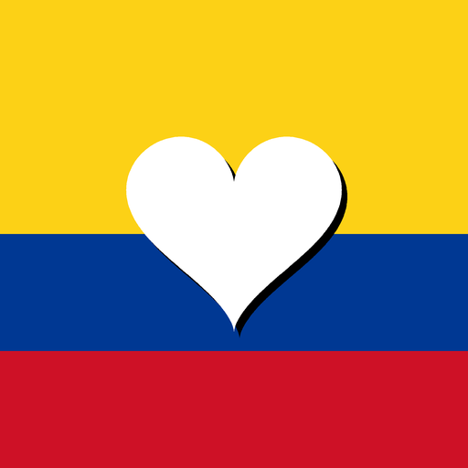
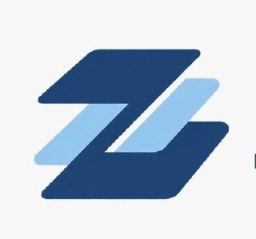

# Ángel Garzón Sarzosa

### AI Solutions Architect · Digital Transformation

**Business strategy + process design + AI engineering**

I help businesses translate operational challenges into AI systems that support sales, productivity and better decisions. My work spans diagnosis, solution architecture, implementation and adoption—connecting people, knowledge and processes around business KPIs.

**Co-Founder & AI Solutions Architect at [NSG](https://www.nsgintelligence.com/).** Industrial Automation Engineer with a foundation in robotics, computer vision and control, and research experience in Spain. I bring that systems perspective to enterprise AI, digital products and projects with social impact.

Popayán, Colombia · [Portfolio](https://angelszs.site/?enfoque=perfil) · [LinkedIn](https://www.linkedin.com/in/angel-garz%C3%B3n-sarzosa-334014337/) · [Email](mailto:angelgarzonsarzosa@gmail.com) · **[Leer en español](README.es.md)**

---

## Six featured projects

Business AI · Tourism · Assistants · Social impact · Digital products

<table>
<tr>
<td width="33%" valign="top" align="center">

<h3>Stratos AI · NSG</h3>

<strong>Commercial intelligence</strong>

CRM and AI assistance connecting lead qualification, advisor context, follow-up and business indicators.

<strong>My contribution:</strong> Solution architecture and AI/business integration with the NSG team.

<a href="https://www.nsgintelligence.com/">NSG ↗</a> · <a href="https://stratoscapitalgroup.com/">Stratos AI ↗</a>

<a href="projects/stratos-ai.md">Project &amp; my contribution →</a>

</td>
<td width="33%" valign="top" align="center">

<h3>TourMaps Go+</h3>

<strong>Tourism, maps &amp; AI</strong>

A tourism app for discovering places, culture and routes in Colombia, starting with Popayán and Cauca.

<strong>My contribution:</strong> AI and mobile integration, conversational route experiences and pilot validation.

<a href="https://play.google.com/store/apps/details?id=com.gopluss.tourmapsgo">Google Play ↗</a>

<a href="projects/tourmaps.md">Project &amp; my contribution →</a>

</td>
<td width="33%" valign="top" align="center">

<h3>Jarvis AIOS</h3>

<strong>Voice, memory &amp; action</strong>

A personal assistant connecting voice, documents, persistent knowledge and authorized tools to everyday work.

<strong>My contribution:</strong> Independent project: agent architecture, knowledge workflows and tool integration.

<a href="https://angelszs.site/jarvis/">Jarvis ↗</a>

<a href="projects/jarvis-aios.md">Project &amp; my contribution →</a>

</td>
</tr>
<tr>
<td width="33%" valign="top" align="center">

<h3>Ayúdame Colombia</h3>

<strong>Technology for community</strong>

A public PWA with maps to coordinate needs, collection points and aid deliveries during emergencies.

<strong>My contribution:</strong> Product and frontend development, local capture and synchronization workflows.

<a href="https://red-de-ayuda-zosa.vercel.app">Ayúdame Colombia ↗</a>

<a href="projects/ayudame-colombia.md">Project &amp; my contribution →</a>

</td>
<td width="33%" valign="top" align="center">

<h3>ZOSA Pages</h3>

<strong>Websites through conversation</strong>

A workflow for creating business websites and updating their content through conversational interfaces.

<strong>My contribution:</strong> Independent project: generation, editing workflows and public demonstration sites.

<a href="https://angelszs.site/?enfoque=negocio#tu-web">ZOSA Pages ↗</a>

<a href="projects/zosa-pages.md">Project &amp; my contribution →</a>

</td>
<td width="33%" valign="top" align="center">

<h3>ALMA Solutions</h3>

<strong>Conversational business assistants</strong>

Voice and WhatsApp assistants for sales and service, including restaurant ordering and kitchen handoff workflows.

<strong>My contribution:</strong> Personal project: conversational workflows, voice integrations and operational automation.

<a href="https://almavirtualsolutions.com">ALMA ↗</a>

<a href="projects/alma-solutions.md">Project &amp; my contribution →</a>

</td>
</tr>
</table>

## Visit the ecosystem

| Destination | What you can explore |
|---|---|
| **[NSG Intelligence ↗](https://www.nsgintelligence.com/)** | AI partnership, business diagnosis, commercial systems and the team |
| **[Stratos AI / Stratos Capital ↗](https://stratoscapitalgroup.com/)** | Stratos AI web platform · [Sign in](https://app.stratoscapitalgroup.com/) · [iPhone app](https://apps.apple.com/cl/app/stratos-ai/id6804826565) |
| **[Jarvis AIOS ↗](https://angelszs.site/jarvis/)** | Product presentation, use cases, demonstration and accompanied pilots |
| **[Ayúdame Colombia ↗](https://red-de-ayuda-zosa.vercel.app)** | Public emergency-coordination PWA · [Source](https://github.com/Ahgarzon/red-de-ayuda) |
| **[ALMA Solutions ↗](https://almavirtualsolutions.com)** | My personal business-assistant project, with restaurant workflows |
| **[TourMaps Go+ ↗](https://play.google.com/store/apps/details?id=com.gopluss.tourmapsgo)** | Existing tourism app on Google Play · [My AI integration work and pilot scope](projects/tourmaps.md) |
| **[ZOSA Pages ↗](https://angelszs.site/?enfoque=negocio#tu-web)** | Business website service · [Examples and public demo code](projects/zosa-pages.md) |
| **[My full portfolio ↗](https://angelszs.site/?enfoque=negocio)** | Demonstrations, project stories, technical foundations and recognition |

Stratos requires an organization account. The case studies explain my role and distinguish public products, demos and pilots.

## From a business problem to a measurable system

I start by understanding what is costing the business time, revenue or control. Then I define the process, the architecture and the indicators that will tell us whether the solution is useful.

| Business objective | What I connect | KPIs to define and track |
|---|---|---|
| Sales execution | CRM, qualification, voice/messaging and follow-up | Response time, follow-up coverage, funnel conversion |
| Operational productivity | OCR, reconciliation, integrations and reporting | Cycle time, manual interventions, rework and exceptions |
| Knowledge continuity | Second brains, source-linked context and agents | Retrieval time, onboarding time, traceability of decisions |
| Adoption and control | Interfaces, team workflows and observability | Active use, task completion, failure and recovery rates |

These are measurement priorities, not claimed results for every project. My approach is **diagnosis → roadmap → architecture → implementation → adoption → measurement and iteration**.

## Second brains & enterprise AIOS

I design knowledge structures that connect projects, processes, decisions and lessons to assistants that retrieve context and use authorized tools. A second brain preserves useful knowledge; an AIOS connects it with execution and traceability.

**My contribution:** knowledge architecture, agent workflows and integrations that help individuals and teams maintain continuity.

[Explore architecture & workflow →](projects/second-brains-aios.md) · [See in my portfolio ↗](https://angelszs.site/?enfoque=negocio#proyectos)

 

## Robotics, computer vision & industrial automation

This is the engineering foundation behind my current work, and an active part of my technical identity.

| Area | Work and technical focus | Explore |
|---|---|---|
| Collaborative robotics & digital twins | UR3e/UR5e coordination through Unity 3D and ROS2; research internship at UMH, Spain | [Research](projects/robotics-vision.md) · [AN5 interfaces](https://github.com/sarriaf/Interfaces-AN5) |
| Autonomous mobile robots | Gazebo simulation, mapping, localization and navigation with SLAM Toolbox, AMCL and Nav2 | [Robotics work](projects/robotics-vision.md) |
| Computer vision & deep learning | SAM annotation, CNN image classification, image processing and visual inspection in Python/MATLAB | [SAM tool](https://github.com/Ahgarzon/Sistema-de-Etiquetado-de-Im-genes-con-SAM) · [Vision collection](https://github.com/Ahgarzon/Proyectos_Inteligencia_Vision-_Artificial) |
| Industrial systems & instrumentation | Automation and control, PLC/SCADA foundations, IoT, signal acquisition and hardware/software integration | [Academic projects](projects/robotics-vision.md) |

## Recognition, research & community

| Milestone | Context |
|---|---|
| 🏅 **Honors thesis · Universidad del Cauca** | Recognition for my Industrial Automation Engineering degree work |
| 🥈 **2nd national place · Cátedra Siemens Colombia** | Automation competition; “Noche de los Mejores” |
| 🎤 **Workshop speaker · Colombia 4.0, 2025** | Autonomous robotics and simulation; [Universidad del Cauca feature](https://www.unicauca.edu.co/noticias-actualidad/cuando-la-pasion-se-convierte-en-innovacion-colombia-4-0/) |
| 🔬 **CIIM 2024 · Co-authorship** | Participation in the research and engineering community |
| 🌍 **International research · UMH, Spain** | February–April 2025 internship in multi-robot interfaces and coordination |

**Regional contribution · TourCauca:** participation in the conceptual and technological structuring of a tourism initiative recognized by Colombia’s Congress, as documented in my [portfolio](https://angelszs.site/?enfoque=negocio). The recognition is attributed to the initiative.

## My path

| Period | Experience | Contribution |
|---|---|---|
| May 2026–present | **Co-Founder & AI Solutions Architect · NSG** | Stratos AI, enterprise AIOS, conversational workflows and architecture aligned with commercial processes |
| 2025–2026 | **Independent projects & collaborations** | Second brains, Jarvis AIOS, Ayúdame Colombia, ZOSA Pages, ALMA, Certipago and TourMaps integration |
| Jan–Apr 2026 | **Automation & AI Full Stack Engineer · Dropi / Clazz Group** | Invoice OCR, reconciliation, currency conversion, ACH/COBRE banking files and e-commerce agents |
| Feb–Apr 2025 | **Research internship · Universidad Miguel Hernández, Spain** | Unity/C# and ROS2 interfaces for UR3e/UR5e coordination |
| 2019–2025 | **Industrial Automation Engineering · Universidad del Cauca** | Robotics, control, computer vision, industrial systems and an honors thesis |

Additional training: **Artificial Intelligence Bootcamp · MinTIC, 2025**.

## More of what I've built

| Area | Selected work |
|---|---|
| **Business AI & operations** | [Stratos AI](projects/stratos-ai.md), [Dropi/Clazz financial automation, ALMA voice and restaurant assistants, Certipago](projects/business-systems.md), order recovery and confirmation, Dental SDR |
| **Knowledge & personal systems** | [Second brains and AIOS](projects/second-brains-aios.md), [Jarvis](projects/jarvis-aios.md), accounting assistant, English-learning assistant and coaching workflows |
| **Products & community** | [Ayúdame Colombia](projects/ayudame-colombia.md), [ZOSA Pages](projects/zosa-pages.md), [TourMaps / TourCauca](projects/tourmaps.md), [Moda Local](https://moda-local.vercel.app), [LinguaLeap](https://github.com/Ahgarzon/LinguaLeap) |
| **Process automation** | Proyecto Fénix reporting, multi-agent quotation, real-estate workflows and product research |
| **Research & engineering** | [Multi-robot interfaces, mobile navigation, SAM, CNN image classification and biomedical instrumentation](projects/robotics-vision.md) |

**[Complete project directory →](PROJECTS.md)** · **[Visual portfolio and demonstrations →](https://angelszs.site/?enfoque=negocio#proyectos)**

## Technical toolkit & ways of working

| Area | Technologies and practices across my work |
|---|---|
| AI & knowledge | LLM APIs, RAG, MCP, LangChain, prompt engineering, agent orchestration, OCR |
| Voice & conversations | Retell AI, Whisper, WhatsApp integrations, Telegram, Chatwoot |
| Engineering with agents | Claude Code, Codex, repository context, code review and end-to-end verification |
| Backend & integration | Python, JavaScript/Node.js, n8n, REST APIs, webhooks, scheduled workflows |
| Data & infrastructure | PostgreSQL, Supabase, SQLite, NocoDB, Firebase/Firestore, Docker, Linux/VPS, Git |
| Digital products | React/Next.js, web/PWA, Flutter, maps and conversational interfaces |
| Business tools & analytics | Shopify, GoHighLevel, Stripe integrations, Power BI, Looker Studio |
| Robotics & vision | ROS2, Unity/C#, Gazebo, SLAM Toolbox, AMCL, Nav2, OpenCV, PyTorch, MATLAB, Arduino |
| Leadership & delivery | Business diagnosis, process mapping, technical roadmaps, KPI/OKR alignment, Scrum, Design Thinking, documentation and mentoring |

## Let's build something that moves the business forward

I work with companies, founders and teams on AI strategy, solution architecture and implementation—from discovering the right problem to building the system and helping people adopt it. I'm open to **consulting, product collaborations and professional opportunities** where I can connect technical depth with business impact.

**[Explore my portfolio](https://angelszs.site/?enfoque=perfil)** · **[LinkedIn](https://www.linkedin.com/in/angel-garz%C3%B3n-sarzosa-334014337/)** · **[Let's talk](mailto:angelgarzonsarzosa@gmail.com)**

Project pages distinguish independent, collaborative and academic work. Public source is linked where available; product case studies do not imply open-source implementations.
