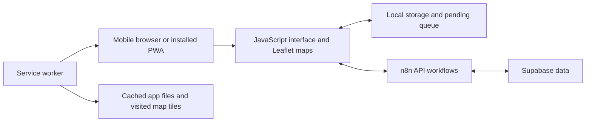

# Ayúdame Colombia

**Community product · Deployed PWA · Public frontend source**

[Profile](../README.md) · [Directory](../PROJECTS.md) · [Open app](https://red-de-ayuda-zosa.vercel.app) · [Source repository](https://github.com/Ahgarzon/red-de-ayuda)

## The problem

During an emergency, information about needs, collection points and deliveries becomes fragmented. A useful coordination tool must work on mobile devices and accommodate unreliable connectivity.

## My contribution

I created the product and designed the interface, maps, local capture, synchronization and backend integrations. Iterations focused on making reporting and coordination understandable to nontechnical users.

## Architecture

## Decisions that shaped the product

| Constraint | Approach | Tradeoff |
|---|---|---|
| Intermittent network | Capture locally and synchronize when connectivity returns | Users need clear pending/synced states |
| A location is not always the user's GPS position | Map selection and place search | Geocoding may require connectivity |
| Use by people with different technical skills | Guided onboarding, large touch targets and plain language | More guidance must fit a small screen |
| Fast access to the map | Self-hosted Leaflet and a service worker | Map areas not previously cached still need network access |

The app also distinguishes coordination information such as needs and deliveries. A community report is information to assess, not automatic official verification.

## What reviewers can inspect

- The [public repository](https://github.com/Ahgarzon/red-de-ayuda) contains the web interface and service-worker implementation.
- The [deployed app](https://red-de-ayuda-zosa.vercel.app) shows the product journey. Please explore without submitting test reports to the live service.
- The screenshot above is an existing public portfolio image, not a current incident-status feed.

## Scope and limits

Offline support covers the application resources and data available on the device. The service worker attempts to preload a low-zoom base map of Colombia and caches visited map tiles. Availability depends on successful downloads and retained device storage; it is not an offline copy of every map area at every zoom level.

The hosted backend is separate from the frontend repository. Cloning the repository does not provision its database or server workflows.

Usage totals and social impact need a defined source and measurement period; no unverified adoption figures are claimed here.
