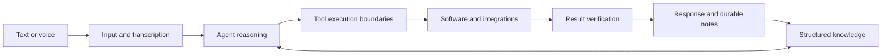

# Jarvis AIOS

**Independent project · Active development · Public architecture overview**

[Profile](../README.md) · [Project directory](../PROJECTS.md) · [Visual presentation](https://angelszs.site/#jarvis)

## The problem

An assistant loses value when it forgets decisions, cannot find working context or stops at giving advice. Jarvis explores how voice, a persistent knowledge base and software tools can form a useful personal operating environment.

## My contribution

I design the architecture, connect the assistant to tools, build the voice interaction and maintain the knowledge workflow. The project brings together my work on AI agents, Node.js integrations, Windows interaction and structured documentation.

## System overview

The current development direction uses Codex/ChatGPT alongside a structured knowledge system and tool integrations. Earlier demonstrations may show earlier engine choices. The durable design is the separation between input, context, reasoning, actions and verification.

## An engineering challenge: silent voice failure

A browser speech recognizer can appear to be listening without producing transcripts. Treating the visible listening indicator as proof of successful capture made that failure hard to diagnose.

The response was to make transcription fallback explicit, add a voice-activity/Whisper path and guard turn finalization so competing recognition paths do not trigger duplicate requests. Useful validation checks include missing transcripts, duplicate finalization, interrupted speech and fallback recovery.

## Design choices

- **Persistent files and explicit links:** make decisions inspectable and maintain context across sessions.
- **Bounded tool actions:** separate a model's proposed action from execution and verification.
- **Multiple input paths:** accommodate failures in browser speech recognition rather than relying on one path.
- **Versioned changes:** keep a recovery path when an integration or voice behavior regresses.

## Status and evidence

This is an actively developed personal system, not a finished general-purpose consumer release. The public portfolio presents its concept and demonstrations; it does not establish acceptance on every device.

This repository publishes a case study, not the private knowledge base or the full implementation. It intentionally excludes personal memory, credentials and operational data. I can discuss the architecture and demonstrate an appropriate isolated workflow.
