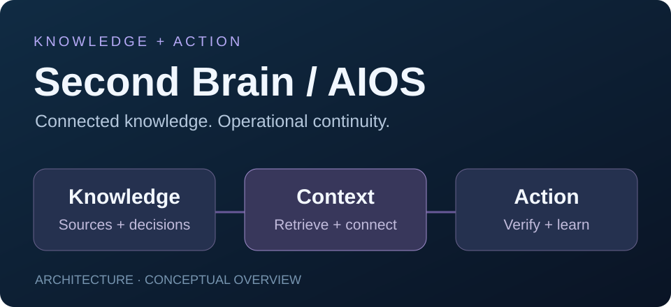

# Second brains & enterprise AIOS

**Organizational knowledge connected to action · Knowledge architecture and AI integration**

[Profile](../README.md) · [Español](../README.es.md) · [Project directory](../PROJECTS.md)

## The problem I work on

Projects, decisions, client context and operating procedures are often scattered across chats, documents and applications. Work loses continuity when people change roles or have to reconstruct what happened before.

I build **second brains** that organize this knowledge into a connected, maintainable source of context, and **AIOS (AI operating systems)** that connect that context with assistants and operational tools.

## Three complementary layers

| Layer | Purpose | What I design |
|---|---|---|
| Second brain | Preserve and retrieve useful knowledge | Linked notes, project records, decisions, procedures, sources and lessons |
| AIOS | Connect context to execution | Agent workflows, authorized tools, integrations, verification and activity records |
| Interface | Make the system usable in everyday work | Conversational access through desktop, mobile, messaging or voice; [Jarvis](jarvis-aios.md) is one interface project |

## A typical workflow

1. **Capture:** record a new fact, decision, document or task with its source.
2. **Organize:** connect it to the relevant person, project or process.
3. **Retrieve:** provide the assistant with the context needed for the current question.
4. **Act:** use tools within the user's permissions and the workflow's boundaries.
5. **Verify:** inspect the actual outcome and preserve a recovery path.
6. **Learn:** update decisions, status and lessons so the next session starts with useful context.

The implementation depends on the organization: structured Markdown and knowledge graphs, databases, retrieval/RAG, APIs, MCP tools and automation workflows can serve different roles. The design starts with ownership and access, then chooses the tools.

## My contribution

I work on the knowledge model, organization of sources, agent instructions, tool integrations and the operating practices that keep context current. This includes separating personal and business knowledge, defining who can access what, and connecting the system to real work rather than leaving it as a document archive.

## What business value looks like

- Less time reconstructing context and searching for decisions.
- Faster onboarding into projects and processes.
- Clearer continuity between a request, an action and its verified result.
- Reusable knowledge that supports teams as well as individual operators.

These are design goals. Useful measurements include retrieval time, onboarding time, repeated work, source traceability and task completion.

**Related:** [Stratos AI](stratos-ai.md) · [Jarvis AIOS](jarvis-aios.md) · [Business systems](business-systems.md) · [Visual portfolio](https://angelszs.site/?enfoque=negocio#proyectos)
