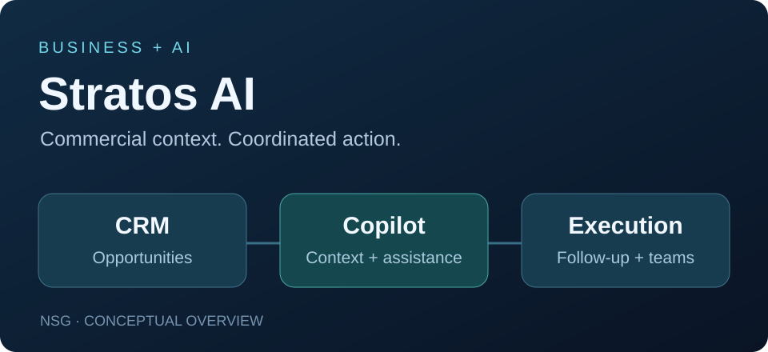

# Stratos AI

**Commercial intelligence, conversational assistance and business operations · NSG**

[Profile](../README.md) · [Español](../README.es.md) · [Project directory](../PROJECTS.md) · [App Store](https://apps.apple.com/cl/app/stratos-ai/id6804826565)

Stratos AI is one of the central projects in my work at NSG. It brings commercial context and daily execution together, with AI assistance integrated into the workflow.

## The business problem

Sales teams need continuity between conversations, customer context, the next action and the person responsible. A CRM becomes more useful when it helps the team decide what needs attention and makes follow-up part of everyday work.

## My contribution

As **Co-Founder & AI Solutions Architect at NSG**, my work connects solution architecture, conversational AI integrations and commercial process design. I collaborate with the team to translate operational needs into workflows, organize the context assistants need and connect AI to business tools.

This is a team product. My contribution is presented from the perspective of architecture and AI/business integration, rather than sole authorship of every component.

## Public product

The [official App Store listing](https://apps.apple.com/cl/app/stratos-ai/id6804826565) describes an iPhone workspace combining opportunity management, customer context, tasks, agenda and a text/voice copilot. It is available to users with an account provided by their organization.

## How I frame impact

| Operational question | Measurement focus |
|---|---|
| Are opportunities receiving timely attention? | Response delay and follow-up coverage |
| Does each opportunity have a next step? | Next-action coverage and overdue work |
| Can the team understand progress? | Funnel movement and activity traceability |
| Is the system becoming part of daily work? | Adoption and task completion |

These indicators define how to evaluate value; client-specific results are not published here.

## Connection to my wider work

Stratos sits at the intersection of **business processes, conversational AI and institutional knowledge**—the same areas I connect in [second brains and enterprise AIOS](second-brains-aios.md).

**Explore:** [NSG](https://www.nsgintelligence.com/) · [My visual portfolio](https://angelszs.site/?enfoque=negocio#proyectos) · [Contact](mailto:angelgarzonsarzosa@gmail.com)
