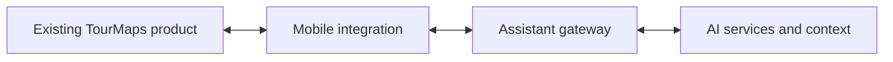

# TourMaps — AI and mobile integration

**Collaborative project · Pilot · Integration case study**

[Profile](../README.md) · [Directory](../PROJECTS.md) · [TourMaps Go+ on Google Play](https://play.google.com/store/apps/details?id=com.gopluss.tourmapsgo) · [My integration pilot APKs](https://github.com/Ahgarzon/tm-apk)

[Leer en español](tourmaps.es.md)

## What TourMaps is

TourMaps Go+ is a tourism app for discovering places, local culture and routes in Colombia, starting with Popayán and Cauca. Its public presentation combines points of interest, maps, multimedia content and travel assistance. [Explore the app on Google Play](https://play.google.com/store/apps/details?id=com.gopluss.tourmapsgo).

## Context

TourMaps is a preexisting tourism application created by James. My work is the AI and mobile integration around that product. This distinction matters: the underlying application and its existing audience are not solely my work.

## My contribution

I work on the conversational-assistance experience, mobile integration and supporting services, including the pilot's testing and release documentation.

## TourCauca and regional tourism

My [public portfolio](https://angelszs.site/?enfoque=negocio) also documents my participation in the conceptual and technological structuring of **TourCauca**, a regional tourism initiative recognized by Colombia's Congress. This is a contribution to a collaborative initiative; the recognition is attributed to the initiative.

## Integration view

This diagram summarizes responsibility boundaries; it is not a claim that every planned behavior is accepted on physical devices.

## Engineering focus

- Keep the assistant connected to the application's user journey.
- Separate mobile behavior from the backend integration contract.
- Track build versions and distinguish emulator checks from physical-device acceptance.
- Verify that a published artifact corresponds to the version described.

## Evidence and current boundary

The [tm-apk repository](https://github.com/Ahgarzon/tm-apk) distributes pilot artifacts. It is **not the application's source-code repository**.

The integration remains a pilot. Emulator checks do not establish real-world GPS, microphone or voice behavior on every phone. This case does not claim a finished release or attribute the existing app's users to the new integration.
