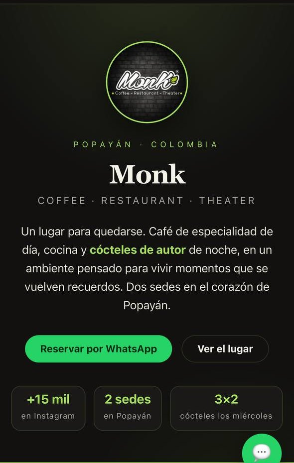
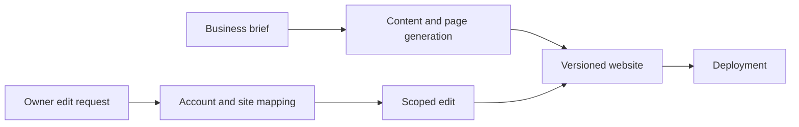

# ZOSA Pages

**Independent project · Website generation and conversational editing · Public demos**

[Profile](../README.md) · [Directory](../PROJECTS.md) · [Portfolio](https://angelszs.site/?enfoque=negocio)

## The problem

Small businesses need a usable website and a practical way to update it. A generated page alone does not solve ownership, future edits or recovery when a change goes wrong.

## My contribution

I build the generation and editing workflow, connect conversational requests to website changes, and organize the repository and deployment flow. The system combines agents with explicit boundaries around the website being edited.

## Workflow

## Important engineering decision

The target repository should come from the verified account-to-site mapping, not from an arbitrary repository name supplied in a conversation. Keeping the client-editing environment separate from personal knowledge and credentials reduces the scope of an accidental or malicious instruction.

Git history provides a way to inspect edits and recover a previous site version.

## Public evidence

The screenshot shows a demonstration website. My [public repositories](https://github.com/Ahgarzon?tab=repositories) include generated site examples, and the [portfolio](https://angelszs.site/?enfoque=negocio) presents the website offering.

Example sites demonstrate output quality. They should not be interpreted as a count of paying customers or as proof that every backend capability is open source.

## Status

The website output and the orchestration system are different artifacts. This case documents the workflow; the full orchestration implementation is not published in this repository.
